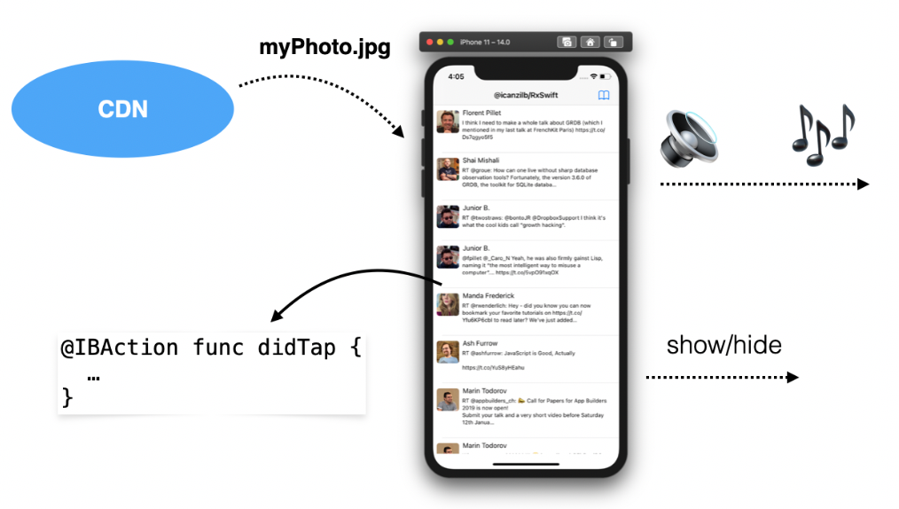

# Chapter 1 - Hello, RxSwift!

This book aims to introduce you, the reader, to the RxSwift library and to writing reactive iOS apps with RxSwift.
But what exactly is RxSwift? Here’s a good definition:

> **RxSwift** is a library for composing asynchronous and event-based code by using observable sequences and functional style operators, allowing for parameterized execution via schedulers.

Sounds complicated? Don’t worry if it does. Writing reactive programs, understanding the many concepts behind them, and navigating a lot of the relevant, commonly used lingo might be intimidating — especially if you try to take it all in at once, or when you haven’t been introduced to it in a structured way.

That’s the goal of this book: to gradually introduce you to the various RxSwift APIs and general Rx concepts by explaining how to use each of the APIs and build intuition about how reactive programming can serve you, all while covering RxSwift's practical usage in iOS apps.

You’ll start with the basic features of RxSwift, and then gradually work through intermediate and advanced topics. Taking the time to exercise new concepts extensively as you progress will make it easier to master RxSwift by the end of the book. Rx is too broad of a topic to cover completely in a single book; instead, we aim to give you a solid understanding of the library so that you can continue developing Rx skills on your own.

We still haven’t quite established what RxSwift is though, have we? Let’s start with a simple, understandable definition and progress to a better, more expressive one as we waltz through the topic of reactive programming later in this chapter.

> **RxSwift**, in its essence, simplifies developing asynchronous programs by allowing your code to react to new data and process it in a sequential, isolated manner.

As an iOS app developer, this should be much more clear and tell you more about what RxSwift is, compared to the first definition you read earlier in this chapter.
Even if you’re still fuzzy on the details, it should be clear that RxSwift helps you write asynchronous code. And you know that developing good, deterministic, asynchronous code is hard, so any help is quite welcome!

## Introduction to asynchronous programming

If you tried to explain asynchronous programming in a simple, down to earth language, you might come up with something along the lines of the following.

An iOS app, at any moment, might be doing any of the following things and more:

* Reacting to button taps
* Animating the keyboard as a text field loses focus
* Downloading a large photo from the Internet
* Saving bits of data to disk
* Playing audio
    

All of these things seemingly happen at the same time. Whenever the keyboard animates out of the screen, the audio in your app doesn’t pause until the animation has finished, right?

