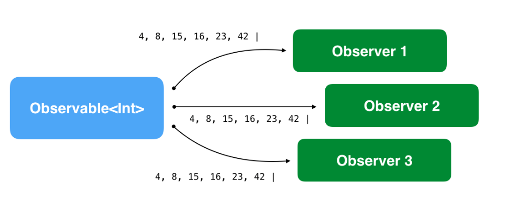
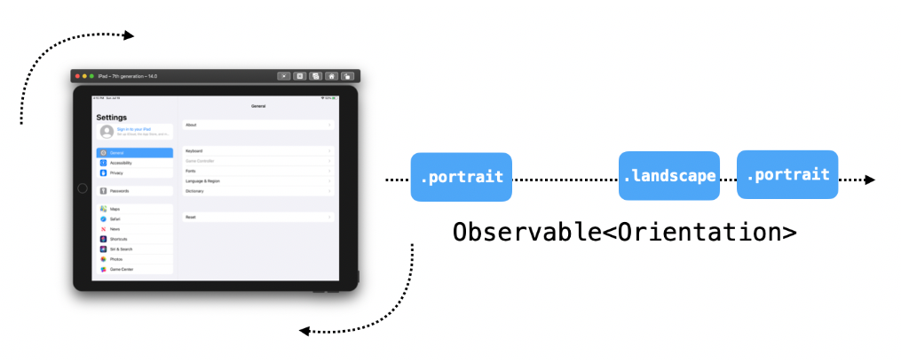
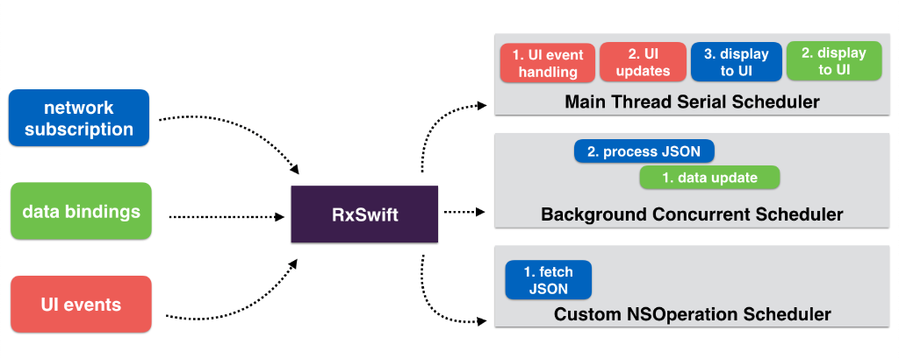
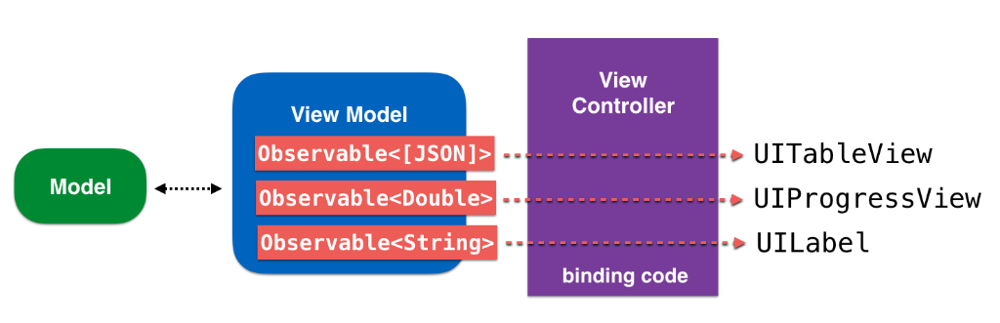
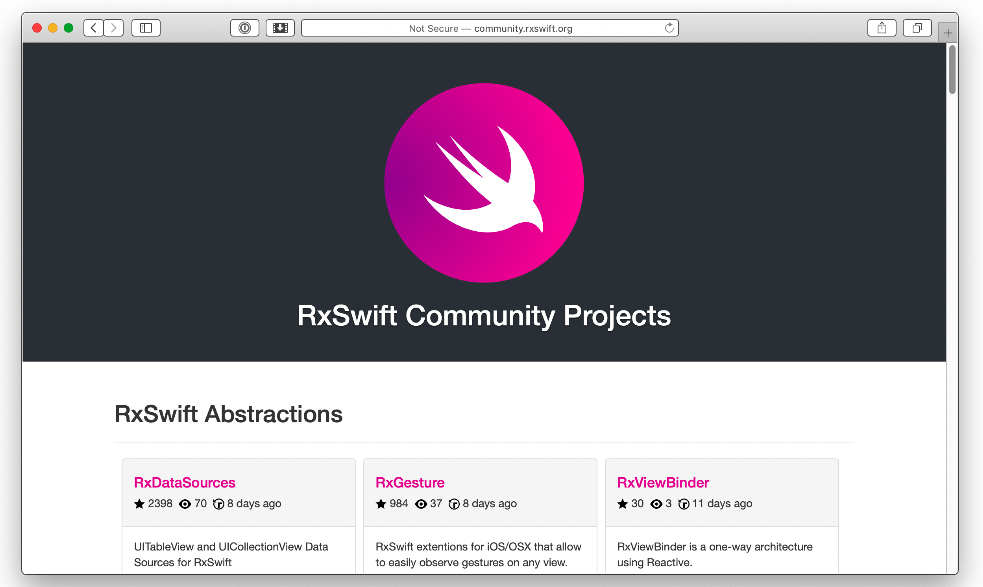

# Chapter 1 - Hello, RxSwift!

This book aims to introduce you, the reader, to the RxSwift library and to writing reactive iOS apps with RxSwift.
But what exactly is RxSwift? Here’s a good definition:

> **RxSwift** is a library for composing asynchronous and event-based code by using observable sequences and functional style operators, allowing for parameterized execution via schedulers.

Sounds complicated? Don’t worry if it does. Writing reactive programs, understanding the many concepts behind them, and navigating a lot of the relevant, commonly used lingo might be intimidating — especially if you try to take it all in at once, or when you haven’t been introduced to it in a structured way.

That’s the goal of this book: to gradually introduce you to the various RxSwift APIs and general Rx concepts by explaining how to use each of the APIs and build intuition about how reactive programming can serve you, all while covering RxSwift's practical usage in iOS apps.

You’ll start with the basic features of RxSwift, and then gradually work through intermediate and advanced topics. Taking the time to exercise new concepts extensively as you progress will make it easier to master RxSwift by the end of the book. Rx is too broad of a topic to cover completely in a single book; instead, we aim to give you a solid understanding of the library so that you can continue developing Rx skills on your own.

We still haven’t quite established what RxSwift is though, have we? Let’s start with a simple, understandable definition and progress to a better, more expressive one as we waltz through the topic of reactive programming later in this chapter.

> **RxSwift**, in its essence, simplifies developing asynchronous programs by allowing your code to react to new data and process it in a sequential, isolated manner.

As an iOS app developer, this should be much more clear and tell you more about what RxSwift is, compared to the first definition you read earlier in this chapter.
Even if you’re still fuzzy on the details, it should be clear that RxSwift helps you write asynchronous code. And you know that developing good, deterministic, asynchronous code is hard, so any help is quite welcome!


## Introduction to asynchronous programming

If you tried to explain asynchronous programming in a simple, down to earth language, you might come up with something along the lines of the following.

An iOS app, at any moment, might be doing any of the following things and more:

* Reacting to button taps
* Animating the keyboard as a text field loses focus
* Downloading a large photo from the Internet
* Saving bits of data to disk
* Playing audio
    

All of these things seemingly happen at the same time. Whenever the keyboard animates out of the screen, the audio in your app doesn’t pause until the animation has finished, right?


All the different bits of your program don’t block each other’s execution. iOS offers you various kinds of APIs that allow you to perform different pieces of work on different threads, across different execution contexts, and perform them across the different cores of the device’s CPU.

Writing code that truly runs in parallel, however, is rather complex, especially when different bits of code need to work with the same pieces of data. It’s hard to know for sure which piece of code updates the data first, or which code read the latest value.


## Cocoa and UIKit asynchronous APIs

Apple has always provided numerous APIs in the iOS SDK that help you write asynchronous code. In fact the best practices on how to write asynchronous code on the platform have evolved many times over the years.

You’ve probably used many of these in your projects and probably haven’t given them a second thought because they are so fundamental to writing mobile apps.

To mention few, you have a choice of:

* NotificationCenter: To execute a piece of code any time an event of interest happens, such as the user changing the orientation of the device or the software keyboard showing or hiding on the screen.
* The delegate pattern: Lets you define an object that acts on behalf, or in coordination with, another object.
* Grand Central Dispatch: To help you abstract the execution of pieces of work. You can schedule blocks of code to be executed sequentially, concurrently, or after a given delay.
* Closures: To create detached pieces of code that you can pass around in your code, and finally
* Combine: Apple's own framework for writing reactive asynchronous code with Swift, introduced in and available from iOS 13.

Depending on which APIs you chose to rely on, the degree of difficulty to maintain your app in a coherent state varies largely.

For example if you're using some of the older Apple APIs like the delegate pattern or notification center you need to do a lot of hard work to keep your app's state consistent at any given time.

If you have a shiny new codebase using Apple's Combine, then (of course) you're already verse with reactive programming - congrats and kudos!

To wrap up this section and put the discussion into a bit more context, you’ll compare two pieces of code: one synchronous and one asynchronous.


### Synchronous code
Performing an operation for each element of an array is something you’ve done plenty of times. It’s a very simple yet solid building block of app logic because it guarantees two things: It executes synchronously, and the collection is immutable while you iterate over it.

Take a moment to think about what this implies. When you iterate over a collection, you don’t need to check that all elements are still there, and you don’t need to rewind back in case another thread inserts an element at the start of the collection. You assume you always iterate over the collection in its entirety at the beginning of the loop.

If you want to play a bit more with these aspects of the for loop, try this in a playground:

```swift
var array = [1, 2, 3]
for number in array {
  print(number)
  array = [4, 5, 6]
}
print(array)
```

Is array mutable inside the for body? Does the collection that the loop iterates over ever change? What’s the sequence of execution of all commands? Can you modify number if you need to?


### Asynchronous code

Consider similar code, but assume each iteration happens as a reaction to a tap on a button. As the user repeatedly taps on the button, the app prints out the next element in an array:

```swift
var array = [1, 2, 3]
var currentIndex = 0

// This method is connected in Interface Builder to a button
@IBAction private func printNext() {
  print(array[currentIndex])
  
  if currentIndex != array.count - 1 {
    currentIndex += 1
  }
}
```

Think about this code in the same context as you did for the previous one. As the user taps the button, will that print all of the array’s elements? You really can’t say. Another piece of asynchronous code might remove the last element, before it’s been printed.

Or another piece of code might insert a new element at the start of the collection after you’ve moved on.

Also, you assume currentIndex is only mutated by printNext(), but another piece of code might modify currentIndex as well — perhaps some clever code you added at some point after crafting the above method.

You’ve likely realized that some of the core issues with writing asynchronous code are: a) the order in which pieces of work are performed and b) shared mutable data.

Luckily, these are some of RxSwift’s strong suits!

Next, you need a good primer on the language that will help you start understanding how RxSwift works and what problems it solves; this will ultimately let you move past this gentle introduction and into writing your first Rx code in the next chapter.


### Asynchronous programming glossary

Some of the language in RxSwift is so tightly bound to asynchronous, reactive, and/or functional programming that it will be easier if you first understand the following foundational terms.
In general, RxSwift tries to address the following issues:

#### 1. State, and specifically, shared mutable state
State is somewhat difficult to define. To understand state, consider the following practical example.

When you start your laptop it runs just fine, but, after you use it for a few days or even weeks, it might start behaving weirdly or abruptly hang and refuse to speak to you. The hardware and software remains the same, but what’s changed is the state. As soon as you restart, the same combination of hardware and software will work just fine once more.

The data in memory, the one stored on disk, all the artifacts of reacting to user input, all traces that remain after fetching data from cloud services — the sum of these is the state of your laptop.

Managing the state of your app, especially when shared between multiple asynchronous components, is one of the issues you’ll learn how to handle in this book.

#### 2. Imperative programming

Imperative programming is a programming paradigm that uses statements to change the program’s state. Much like you would use imperative language while playing with your dog — “Fetch! Lay down! Play dead!” — you use imperative code to tell the app exactly when and how to do things.

Imperative code is similar to the code that your computer understands. All the CPU does is follow lengthy sequences of simple instructions. The issue is that it gets challenging for humans to write imperative code for complex, asynchronous apps — especially when shared mutable state is involved.

For example, take this code, found in viewDidAppear(_:) of an iOS view controller:

```swift
override func viewDidAppear(_ animated: Bool) {
  super.viewDidAppear(animated)

  setupUI()
  connectUIControls()
  createDataSource()
  listenForChanges()
}
```

There’s no telling what these methods do. Do they update properties of the view controller itself? More disturbingly, are they called in the right order? Maybe somebody inadvertently swapped the order of these method calls and committed the change to source control. Now the app might behave differently due to the swapped calls.

#### 3. Side effects

Now that you know more about mutable state and imperative programming, you can pin down most issues with those two things to side effects.

Side effects represent any changes to the state outside of your code's current scope. For example, consider the last piece of code in the example above. connectUIControls() probably attaches some kind of event handler to some UI components. This causes a side effect, as it changes the state of the view: The app behaves one way before executing connectUIControls() and differently after that.

Any time you modify data stored on disk or update the text of a label on screen, you cause a side effect.

Side effects are not bad in themselves. After all, causing side effects is the ultimate goal of any program! You need to change the state of the world somehow after your program has finished executing.

Running for a while and doing nothing makes for a pretty useless app.

The important aspect of producing side effects is doing so in a controlled way. You need to be able to determine which pieces of code cause side effects, and which simply process and output data.

RxSwift tries to address the issues (or problems) listed above by tackling the following couple of concepts.

#### 4. Declarative code

In imperative programming, you change state at will. In functional programming, you aim to minimize the code that causes side effects. Since you don’t live in a perfect world, the balance lies somewhere in the middle. RxSwift combines some of the best aspects of imperative code and functional code.

Declarative code lets you define pieces of behavior. RxSwift will run these behaviors any time there’s a relevant event and provide an immutable, isolated piece of data to work with.

This way, you can work with asynchronous code, but make the same assumptions as in a simple for loop: that you’re working with immutable data and can execute code in a sequential, deterministic way.

#### 5. Reactive systems
Reactive systems is a rather abstract term and covers web or iOS apps that exhibit most or all of the following qualities:

* Responsive: Always keep the UI up to date, representing the latest app state.
* Resilient: Each behavior is defined in isolation and provides for flexible error recovery.
* Elastic: The code handles varied workload, often implementing features such as lazy pull-driven data collections, event throttling, and resource sharing.
* Message-driven: Components use message-based communication for improved reusability and isolation, decoupling the lifecycle and implementation of classes.

Now that you have a good understanding of the problems RxSwift helps solve and how it approaches these issues, it’s time to talk about the building blocks of Rx and how they play together.


## Foundation of RxSwift

Reactive programming isn’t a new concept; it’s been around for a fairly long time, but its core concepts have made a noticeable comeback over the last decade.

In that period, web apps have became more involved and are facing the issue of managing complex asynchronous UIs. On the server side, reactive systems (as described above) have become a necessity.

A team at Microsoft took on the challenge of solving the problems of asynchronous, scalable, real-time app development that we’ve discussed in this chapter. Sometime around 2009 they offered a new client and server side framework called Reactive Extensions for .NET (Rx).

Rx for .NET has been open source since 2012 permitting other languages and platforms to reimplement the same functionality, which turned Rx into a cross-platform standard.

Today, you have RxJS, RxKotlin, Rx.NET, RxScala, RxSwift and more. All strive to implement the same behavior and same expressive APIs, based on the Reactive Extensions specification. Ultimately, a developer creating an iOS app with RxSwift can freely discuss app logic with another programmer using RxJS on the web.

> Note: More about the family of Rx implementations at http://reactivex.io.
>

Like the original Rx, RxSwift also works with all the concepts you’ve covered so far: It tackles mutable state, it allows you to compose event sequences and improves on architectural concepts such as code isolation, reusability and decoupling.

In this book, you are going to cover both the cornerstone concepts of developing with RxSwift as well as real-world examples of how to use them in your apps.

The three building blocks of Rx code are observables, operators and schedulers. The sections below cover each of these in detail.


### Observables

Observable<Element> provides the foundation of Rx code: the ability to asynchronously produce a sequence of events that can “carry” an immutable snapshot of generic data of type Element. In the simplest words, it allows consumers to subscribe for events, or values, emitted by another object over time.

The Observable class allows one or more observers to react to any events in real time and update the app's UI, or otherwise process and utilize new and incoming data.

The ObservableType protocol (to which Observable conforms) is extremely simple. An Observable can emit (and observers can receive) only three types of events:


* **A next event**: An event that “carries” the latest (or "next") data value. This is the way observers “receive” values. An Observable may emit an indefinite amount of these values, until a terminating event is emitted.
* **A completed event**: This event terminates the event sequence with success. It means the Observable completed its lifecycle successfully and won’t emit additional events.
* **An error event**: The Observable terminates with an error and will not emit additional events.
    When talking about asynchronous events emitted over time, you can visualize an observable stream of integers on a timeline, like so:


This simple contract of three possible events an Observable can emit is anything and everything in Rx. Because it is so universal, you can use it to create even the most complex app logic.

Since the observable contract does not make any assumptions about the nature of the Observable or the observer, using event sequences is the ultimate decoupling practice.

You don’t ever need to use delegate protocols or to inject closures to allow your classes to talk to each other.



To get an idea about some real-life situations, you’ll look at two different kinds of observable sequences: **finite and infinite.**


#### Finite observable sequences

Some observable sequences emit zero, one or more values, and, at a later point, either terminate successfully or terminate with an error.

In an iOS app, consider code that downloads a file from the internet:

* First, you start the download and start observing for incoming data.
* You then repeatedly receive chunks of data as parts of the file arrive.
* In the event the network connection goes down, the download will stop and the connection will time out with an error.
* Alternatively, if the code downloads all the file’s data, it will complete with success.

This workflow accurately describes the lifecycle of a typical observable. Take a look at the related code below:

```swift
API.download(file: "http://www...")
   .subscribe(
     onNext: { data in
      // Append data to temporary file
     },
     onError: { error in
       // Display error to user
     },
     onCompleted: {
       // Use downloaded file
     }
   )
```

API.download(file:) returns an Observable<Data> instance, which emits Data values as chunks of data fetched over the network.
You subscribe for next events by providing the onNext closure. In the downloading example, you append the data to a temporary file stored on disk.

You subscribe for an error by providing the onError closure. In this closure, you can display the error.localizedDescription in an alert box or otherwise handle your error.

Finally, to handle a completed event, you provide the onCompleted closure, where you can push a new view controller to display the downloaded file or anything else your app logic dictates.

#### Infinite observable sequences

Unlike file downloads or similar activities, which are supposed to terminate either naturally or forcefully, there are other sequences which are simply infinite. Often, UI events are such infinite observable sequences.

For example, consider the code you need to react to device orientation changes in your app:

* You add your class as an observer to UIDeviceOrientationDidChange notifications from NotificationCenter.
* You then need to provide a method callback to handle orientation changes. It needs to grab the current orientation from UIDevice and react accordingly to the latest value.

This sequence of orientation changes does not have a natural end. As long as there is a device, there is a possible sequence of orientation changes. Further, since the sequence is virtually infinite and stateful, you always have an initial value at the time you start observing it.



It may happen that the user never rotates their device, but that doesn’t mean the sequence of events is terminated. It just means there were no events emitted.

In RxSwift, you could write code like this to handle device orientation:

```swift
UIDevice.rx.orientation
  .subscribe(onNext: { current in
    switch current {
    case .landscape:
      // Re-arrange UI for landscape
    case .portrait:
      // Re-arrange UI for portrait
    }
  })
```

UIDevice.rx.orientation is a fictional control property that produces an Observable<Orientation> (this is very easy to code yourself; you’ll learn how in the next chapters). You subscribe to it and update your app UI according to the current orientation. You skip the onError and onCompleted arguments, since these events can never be emitted from that observable.


### Operators

ObservableType and the implementation of the Observable class include plenty of methods that abstract discrete pieces of asynchronous work and event manipulations, which can be composed together to implement more complex logic. Because they are highly decoupled and composable, these methods are most often referred to as operators.
Since these operators mostly take in asynchronous input and only produce output without causing side effects, they can easily fit together, much like puzzle pieces, and work to build a bigger picture.
For example, take the mathematical expression: (5 + 6) * 10 - 2.
In a clear, deterministic way, you can apply the operators *, ( ), + and - in their predefined order to the pieces of data that are their input, take their output and keep processing the expression until it’s resolved.

“In a somewhat similar manner, you can apply Rx operators to the events emitted by an Observable to deterministically process inputs and outputs until the expression has been resolved to a final value, which you can then use to cause side effects.
Here’s the previous example about observing orientation changes, adjusted to use some common Rx operators:”

摘录来自
Untitled
By Marin Todorov
此材料可能受版权保护。


```
“UIDevice.rx.orientation
  .filter { $0 != .landscape }
  .map { _ in "Portrait is the best!" }
  .subscribe(onNext: { string in
    showAlert(text: string)
  })”

摘录来自
Untitled
By Marin Todorov
此材料可能受版权保护。
```

“Each time UIDevice.rx.orientation produces either a .landscape or .portrait value, RxSwift will apply filter and map to that emitted piece of data.”

摘录来自
Untitled
By Marin Todorov
此材料可能受版权保护。


“First, filter will only let through values that are not .landscape. If the device is in landscape mode, the subscription code will not get executed because filter will suppress these events.
In case of .portrait values, the map operator will take the Orientation type input and convert it to a String output — the text "Portrait is the best!”

摘录来自
Untitled
By Marin Todorov
此材料可能受版权保护。


“Finally, with subscribe, you subscribe for the resulting next event, this time carrying a String value, and you call a method to display an alert with that text onscreen.
The operators are also highly composable — they always take in data as input and output their result, so you can easily chain them in many different ways achieving so much more than what a single operator can do on its own!
As you work through the book, you will learn about more complex operators that abstract more involved pieces of asynchronous work.”

摘录来自
Untitled
By Marin Todorov
此材料可能受版权保护。


### Schedulers

“Schedulers are the Rx equivalent of dispatch queues or operation queues — just on steroids and much easier to use. They let you define the execution context of a specific piece of work.
RxSwift comes with a number of predefined schedulers, which cover 99% of use cases and hopefully means you will never have to go about creating your own scheduler.
In fact, most of the examples in the first half of this book are quite simple and generally deal with observing data and updating the UI, so you won’t look into schedulers at all until you’ve covered the basics.
That being said, schedulers are very powerful.”

摘录来自
Untitled
By Marin Todorov
此材料可能受版权保护。


“For example, you can specify that you’d like to observe next events on a SerialDispatchQueueScheduler, which uses Grand Central Dispatch to run your code serially on a given queue.
ConcurrentDispatchQueueScheduler will run your code concurrently, while OperationQueueScheduler will allow you to schedule your subscriptions on a given OperationQueue.
Thanks to RxSwift, you can schedule your different pieces of work of the same subscription on different schedulers to achieve the best performance fitting your use-case.
RxSwift will act as a dispatcher between your subscriptions (on the left-hand side below) and the schedulers (on the right-hand side), sending the pieces of work to the correct context and seamlessly allowing them to work with each other’s output.”

摘录来自
Untitled
By Marin Todorov
此材料可能受版权保护。





“To read this diagram, follow the colored pieces of work in the sequence they were scheduled (1, 2, 3, ...) across the different schedulers. For example:
The blue network subscription starts with a piece of code (1) that runs on a custom OperationQueue-based scheduler.
The data output by this block serves as the input of the next block (2), which runs on a different scheduler, which is on a concurrent background GCD queue.
Finally, the last piece of blue code (3) is scheduled on the Main thread scheduler in order to update the UI with the new data.
Even if it looks very interesting and quite handy, don’t bother too much with schedulers right now. You’ll return to them later in this book.”

摘录来自
Untitled
By Marin Todorov
此材料可能受版权保护。


## App architecture

“It’s worth mentioning that RxSwift doesn’t alter your app’s architecture in any way; it mostly deals with events, asynchronous data sequences and a universal communication contract.
It’s also important to note that you definitely do not have to start a project from scratch to make it a reactive app; you can iteratively refactor pieces of an exiting project or simply use RxSwift when building new features for your app.”

摘录来自
Untitled
By Marin Todorov
此材料可能受版权保护。

“You can create apps with Rx by implementing a Model-View-Controller architecture, Model-View-Presenter, or Model-View-ViewModel (MVVM), or any other pattern that makes your life easier.
RxSwift and MVVM specifically do play nicely together. The reason is that a ViewModel allows you to expose Observable properties, which you can bind directly to UIKit controls in your View controller's glue code. This makes binding model data to the UI very simple to represent and to code:”

摘录来自
Untitled
By Marin Todorov
此材料可能受版权保护。



“Towards the end of this book, you’ll look into that pattern and how to implement it with RxSwift. All other examples in the book use the MVC architecture in order to keep the sample code simple and easy to understand.”

摘录来自
Untitled
By Marin Todorov
此材料可能受版权保护。


## RxCocoa

“RxSwift is the implementation of the common, platform-agnostic, Rx specification. Therefore, it doesn’t know anything about any Cocoa or UIKit-specific classes.
RxCocoa is RxSwift’s companion library holding all classes that specifically aid development for UIKit and Cocoa. Besides featuring some advanced classes, RxCocoa adds reactive extensions to many UI components so that you can subscribe to various UI events out of the box.
For example, it’s very easy to use RxCocoa to subscribe to the state changes of a UISwitch, like so:”

摘录来自
Untitled
By Marin Todorov
此材料可能受版权保护。

```
“toggleSwitch.rx.isOn
  .subscribe(onNext: { isOn in
    print(isOn ? "It's ON" : "It's OFF")
  })”

摘录来自
Untitled
By Marin Todorov
此材料可能受版权保护。
```


“RxCocoa adds the rx.isOn property (among others) to the UISwitch class so you can subscribe to useful events as reactive Observable sequences.”

摘录来自
Untitled
By Marin Todorov
此材料可能受版权保护。


“Further, RxCocoa adds the rx namespace to UITextField, URLSession, UIViewController and many more, and even lets you define your own reactive extensions under this namespace, which you'll learn more about later in this book.”

摘录来自
Untitled
By Marin Todorov
此材料可能受版权保护。


## Installing RxSwift

“RxSwift is open-source and available for free at https://bit.ly/2ZOzK2i.
RxSwift is distributed under the MIT license, which in short allows you to include the library in free or commercial software, on an as-is basis. As with all other MIT-licensed software, the copyright notice should be included in all apps you distribute.
There is plenty to explore in the RxSwift repository. It includes the RxSwift, RxCocoa, and RxRelay libraries, but you will also find RxTest and RxBlocking in there, which allow you to write tests for your RxSwift code.
Besides all the great source code (definitely worth peeking into), you will find Rx.playground, which interactively demonstrates many of the operators. Also check out RxExample, which is a great showcase app that demonstrates many of the concepts in practice.
”

摘录来自
Untitled
By Marin Todorov
此材料可能受版权保护。

“You can install RxSwift/RxCocoa in few different ways - either via Xcode's built-in dependency management, via Cocoapods, or Carthage.”

摘录来自
Untitled
By Marin Todorov
此材料可能受版权保护。


###  RxSwift via CocoaPods

“You can install RxSwift via CocoaPods like any other CocoaPod. A typical Podfile would look something like this:”

摘录来自
Untitled
By Marin Todorov
此材料可能受版权保护。

```
“use_frameworks!

target 'MyTargetName' do
  pod 'RxSwift', '~> 5.1'
  pod 'RxCocoa', '~> 5.1'
end”

摘录来自
Untitled
By Marin Todorov
此材料可能受版权保护。
```


“Of course, you can include just RxSwift, both RxSwift and RxCocoa, or even all the libraries found in the GitHub repository.”

摘录来自
Untitled
By Marin Todorov
此材料可能受版权保护。


### RxSwift via Carthage
Installing RxSwift via Carthage is almost equally streamlined. First, make sure you’ve installed the latest version of Carthage from here: https://bit.ly/3cd1fF5.
In your project, create a new file named Cartfile and add the following line to it:”

摘录来自
Untitled
By Marin Todorov
此材料可能受版权保护。


```
“github "ReactiveX/RxSwift" ~> 5.1”

摘录来自
Untitled
By Marin Todorov
此材料可能受版权保护。
```

“Next, within the folder of your project execute carthage update.
This will download the source code of all libraries included in the RxSwift repository and build them, which might take some time. Once the process finishes, find the resulting framework files in the Carthage subfolder created inside the current folder and link them in your project.
Build once more to make sure Xcode indexes the newly added frameworks, and you’re ready to go.”

摘录来自
Untitled
By Marin Todorov
此材料可能受版权保护。


### “Installing RxSwift in the book projects”

摘录来自
Untitled
By Marin Todorov
此材料可能受版权保护。

“The projects in this book all come with a completed Podfile to use with CocoaPods, but without RxSwift itself installed, to keep the download size of the book projects light.
Before you start working on the book, make sure you have the latest version of CocoaPods installed. You need to do that just once before starting to work on the book’s projects. Usually executing this in Terminal will suffice:”

摘录来自
Untitled
By Marin Todorov
此材料可能受版权保护。


```
“sudo gem install cocoapods”

摘录来自
Untitled
By Marin Todorov
此材料可能受版权保护。
```

“If you want to know more, visit the CocoaPods website: https://bit.ly/2XGIvIN.
At the start of each chapter, you will be asked to open the starter project for that chapter and install RxSwift in the starter project. This is an easy operation:
In the book folder, find the directory matching the name of the chapter you are working on.
Copy the starter folder in a convenient location on your computer. A location in your user folder is a good idea.
Open the built-in Terminal.app or another one you use on daily basis and navigate to the starter folder. Type cd /users/yourname/path/to/starter, replacing the example path with the actual path on your computer.
In the chapters you'll be using a Playground, simply run ./bootstrap.sh, which will fetch RxSwift from GitHub, pre-build the framework, and then automatically open Xcode for you so you can start writing some code.
“In chapters you'll be using a standard Xcode project, type pod install to fetch RxSwift from GitHub and install it in the chapter project. Find the newly created .xcworkspace file and launch it. Build the workspace one time in Xcode.
You’re now ready to work through the chapter!”

摘录来自
Untitled
By Marin Todorov
此材料可能受版权保护。


> “Note: While all playgrounds were tested under Xcode 11, Xcode 12 suffers from a myriad of issues related to playground support with third-party dependencies, such as RxSwift. If one of the provided playgrounds in this book doesn't work for you, we suggest copy and pasting the code from the playgrounds into a regular project with RxSwift embedded into it, or working with Xcode 11 in regards to these specific chapters.”
>
> 摘录来自
> Untitled
> By Marin Todorov
> 此材料可能受版权保护。


## RxSwift and Combine
In this introductory chapter you got a taste of what RxSwift is all about. We spoke about some of the benefits of writing reactive code with RxSwift over using more traditional APIs like notification center and delegates.
Before wrapping up, it's definitely worth expanding a bit on what we already mentioned earlier - Apple's own reactive framework called Combine.
RxSwift and Combine (as well as other reactive programming frameworks in Swift) share a lot of common language and very similar concepts.”

摘录来自
Untitled
By Marin Todorov
此材料可能受版权保护。

“RxSwift is an older, well established framework with some of its own, original concepts, operator names and type variety mainly due to its multi-platform cross-language standard, which works also on Linux which is great for Server-Side Swift. It's also open source so you can, if you so wish, contribute directly to its core, and see exactly how specific portions of it work. It's compatible with all Apple platform versions that support Swift all the way back to iOS 8.
Combine is Apple's new and shiny framework that covers similar concepts but tailored specifically towards Swift and Apple's own platforms. It shares a lot of the common language with the Swift standard library so the APIs feel very familiar even to newcomers. It supports only the newer Apple platforms starting at iOS 13, macOS 10.15, etc. It is unfortunately not open-source as of today, and does not support Linux.
”

摘录来自
Untitled
By Marin Todorov
此材料可能受版权保护。

“Luckily, since RxSwift and Combine resemble each other so closely, your RxSwift knowledge is easily transferable to Combine, and vice-versa. And projects such as RxCombine (https://github.com/CombineCommunity/RxCombine) allow you to mix-and-match RxSwift Observables and Combine Publishers based on your needs.”

摘录来自
Untitled
By Marin Todorov
此材料可能受版权保护。

“If you'd like to learn more about Combine - we've created the definitive book on that framework too "Combine: Asynchronous Programming with Swift" which you can check out here:
https://bit.ly/3dgOGds.
Community
The RxSwift project is alive and buzzing with activity, not only because Rx is inspiring programmers to create cool software with it, but also due to the positive nature of the community that formed around this project.
The RxSwift community is very friendly, open minded and enthusiastic about discussing patterns, common techniques or just helping each other.
Besides the official RxSwift repository, you’ll find plenty of projects created by Rx enthusiasts here: http://community.rxswift.org.”

摘录来自
Untitled
By Marin Todorov
此材料可能受版权保护。





“Even more Rx libraries and experiments, which spring up like mushrooms after the rain, can be found, here: https://github.com/RxSwiftCommunity
Probably the best way to meet many of the people interested in RxSwift is the Slack channel dedicated to the library: http://slack.rxswift.org.
The Slack channel has almost 8,000 members! Day-to-day topics are: helping each other, discussing potential new features of RxSwift or its companion libraries, and sharing RxSwift blog posts and conference talks.”

摘录来自
Untitled
By Marin Todorov
此材料可能受版权保护。


## “Where to go from here?”

摘录来自
Untitled
By Marin Todorov
此材料可能受版权保护。


“This chapter introduced you to many of the problems that RxSwift addresses. You learned about the complexities of asynchronous programming, sharing mutable state, causing side effects and more.
You haven’t written any RxSwift code yet, but you now understand why RxSwift is a good idea and you’re aware of the types of problems it solves. This should give you a good start as you work through the rest of the book.
And there is plenty to work through. You’ll start by creating very simple observables and work your way up to complete real-world apps using MVVM architecture.
Move right on to Chapter 2, “Observables”!”

摘录来自
Untitled
By Marin Todorov
此材料可能受版权保护。


